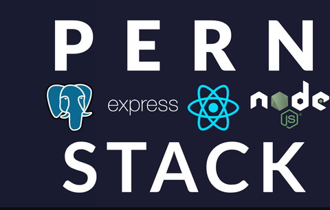
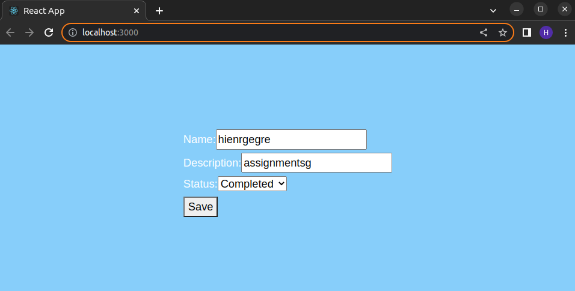

# This is a NODEJS assignment -- TODO LIST
------------------------------------------------
## Introduction:
the purpose of this assignment is to evaluate the knowledge and exprerience  for web development.

* Language:JavaScript
* Framework: ExpressJS
* Database: PostgreSQL

### Requirements:
Create a personal todo application. Which allows user to create/update/alter/delete/fetch APIs.

### How to run the application:
##### On the server side:
Open a terminal and cd to the server side, then run this commands:

```
nodemon index.js
OR 
node index
```

keep the server running 

##### On the client side:
Language: JavaScript
Framework: ReactJS
Database: localhost server at 5000 

Open a terminal and cd to the client side, then run this commands:

```
npm start
```
IF there is anything went wrong with npm packages. 
Pls remove "node_module" and "package-lock.json". then run:
```
npm install
```
It should fix the issue

Or do this extra steps: 
```
npm audit
npm audit fix
npm audit fix --force
```
To address and fix the following issues.


----------------------
### Demo of this application:
##### This application is using:


##### Demo on localhost:


